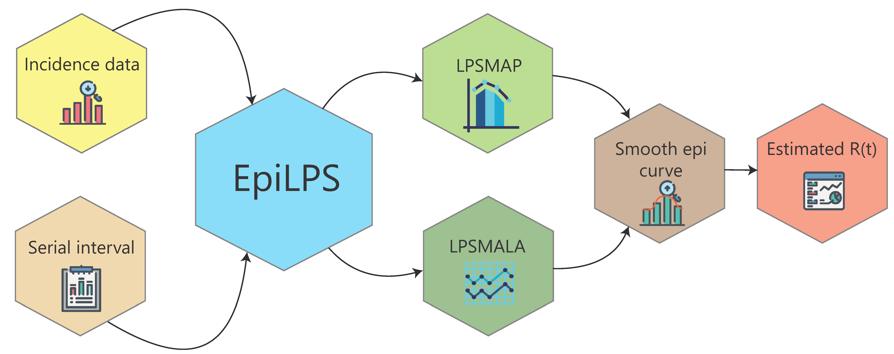
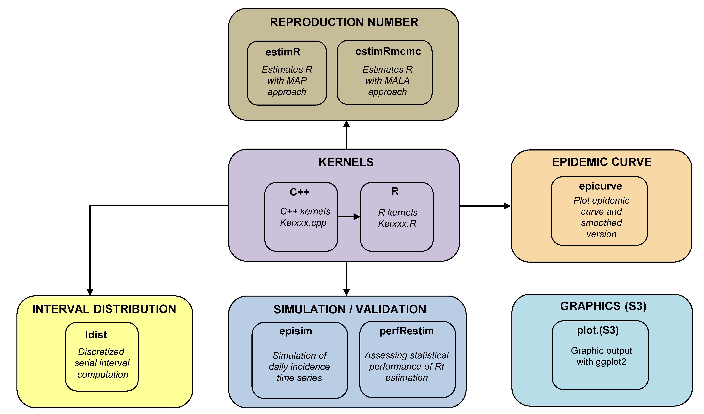

```{r, include = FALSE}
knitr::opts_chunk$set(
  collapse = TRUE,
  comment = "#>"
)
```

```{r, include=FALSE}
library("EpiLPS")
library("EpiEstim")
```

## 1 Motivation

**EpiLPS** <a>(Gressani et al. 2022)</a> is the acronym for **Epi**demiological modeling (tool) with **L**aplacian-**P**-**S**plines. It proposes a new Bayesian methodology for estimating (key) epidemiological parameters. This vignette focuses on the estimation of the time-varying reproduction number $\mathcal{R}_t$, i.e. the average number of secondary cases generated by an infectious agent at time $t$; a key metric for assessing the transmission dynamics of an infectious disease and a useful reference for guiding interventions of governmental institutions in a public health crisis. The EpiLPS project builds upon two strong pillars in the statistical literature, namely Bayesian P-splines and Laplace approximations, to deliver a fast and flexible methodology for inference on $\mathcal{R}_t$. EpiLPS requires two (external) inputs: (1) a time series of incidence counts and (2) a (discrete) serial interval distribution.

The underlying model for smoothing incidence counts is based on the negative binomial distribution to account for possible overdispersion in the data. EpiLPS has a two-phase engine for estimating $\mathcal{R}_t$. First, Bayesian P-splines are used to smooth the epidemic curve and to compute estimates of the mean incidence count of the susceptible population at each day of the outbreak. Second, in the philosophy of <a>Fraser (2007)</a>, the renewal equation is used as a bridge to link the estimated mean incidence and the reproduction number. As such, the second phase delivers a closed-form expression of $\mathcal{R}_t$ as a function of the B-spline coefficients and the serial interval distribution.

Another key strength of EpiLPS is that two different strategies can be used to estimate $\mathcal{R}_t$. The first approach called LPSMAP is completely sampling-free and fully relies on Laplace approximations and maximum *a posteriori* (MAP) computation of model hyperparameters for estimation. Routines for Laplace approximations and B-splines evaluations are typically the ones that are computationally most intensive and are therefore coded in C++ and integrated in R via the **Rcpp** package, making them time irrelevant. The second approach is called LPSMALA (Laplacian-P-splines with a Metropolis-adjusted Langevin algorithm) and is fully stochastic. It samples the posterior of the model by using Langevin diffusions in a Metropolis-within-Gibbs framework. Of course, LPSMAP has a computational advantage over LPSMALA. Thanks to the lightning fast implementation of Laplace approximations, LPSMAP typically delivers estimates of $\mathcal{R}_t$ in a fraction of a second. 

```{r, out.width='100%', fig.align='center', fig.cap='', echo=FALSE}

```

### 1.1 EpiLPS package architecture

The package has a modular architecture with simple routines aiming at an intuitive command input for users. Kernel routines (the machinery responsible for the hard computational work behind EpiLPS) are not directly surfaced to the user, i.e. they are not directly available in the package documentation but can be accessed by typing `ls(getNamespace("EpiLPS"), all.names = TRUE)` in the R console. All the routines starting with *"Ker"* are Kernel routines. These routines include (among others) likelihood evaluations, gradient and Hessian evaluations and posterior distribution evaluations.

The `estimR()` and `estimRmcmc()` routines can be used to estimate the time-varying reproduction number using Laplacian-P-splines with the MAP approach and MALA approach, respectively. The `epicurve()` function can be used to obtain a graphical representation of the epidemic curve (and its smoothed version), while the `Idist()` routine is meant to compute the (discrete) distribution of a disease interval, for instance the serial interval distribution to be used as an input in `estimR()`. Finally, there are some S3 methods available to summarize estimation results and an `episim()` routine to simulate time series of incidence data based on different functional patterns of the reproduction number over time.

<br>

```{r, out.width='100%', fig.align='center', fig.cap='', echo=FALSE}

```

### 1.2 EpiLPS website and GitHub repository

The package has an associated website <https://epilps.com/> that includes documentation and a Shiny application on COVID-19 data. The associated GitHub repository <https://github.com/oswaldogressani/EpiLPS> hosts the in-development version before the associated stable version is released on CRAN. To install the GitHub version of EpiLPS (with devtools) type the following lines in the R console:

```{r devepilps, eval=FALSE}
install.packages("devtools")
devtools::install_github("oswaldogressani/EpiLPS")
```

## 2 A simulated example

### 2.1 Specification of a serial interval and data generation 

To estimate $\mathcal{R}_t$, EpiLPS requires a (discrete) serial interval distribution, i.e. a discrete probability distribution and a time series of incidence data. The `Idist()` function computes the probability density function and probability mass function for a disease interval based on the mean and standard deviation of the disease interval (expressed in days). The code below is used to obtain a (discrete) serial interval `si` for a given mean and standard deviation. By default these values are obtained by assuming a Gamma distribution for the disease interval, but the Weibull or LogNormal distributions can also be specified in the `dist=` option.

```{r si_interval, fig.align='center', fig.width=6.3}
si_spec <- Idist(mean = 2.7, sd = 1.3, dist = "gamma")
si <- si_spec$pvec
si
plot(si_spec, titlesize = 12)
```

By calling `plot()` on the `si_spec` object, a plot of the serial interval is created with the discrete and continuous distribution. On top of that, the `si_spec` object also returns the (fitted) parameters for the chosen distribution of the disease interval that is also reflected in the plot title. Now, using the above serial interval, we can call the `episim()` routine to generate a time series of incidence data (say for an epidemic lasting 40 days). The data generating process (DGP) requires the specification of a functional form for the reproduction number (here we choose `Rpattern = 5` among the six available patterns). A renewal equation model is used to generate the case incidence data based on a Poisson or negative binomial process (to be chosen by the user). Full details on the DGP can be found here <https://doi.org/10.1371/journal.pcbi.1010618.s002>.

```{r episim, fig.align='center', fig.width=7, fig.height=2.8}
set.seed(123)
datasim <- episim(si = si, Rpattern = 5, endepi = 40, dist = "negbin", overdisp = 15, plotsim = TRUE)
incidence <- datasim$y
incidence
```

By default, the number of cases at time $t=1$ is fixed at 10. Specifying option `plotsim = TRUE` gives a summary plot of the generated data and the right panel gives the true underlying functional form of the reproduction number over the 40 days (as specified by `Rpattern = 5`). We now have a serial interval distribution and a time series of incidence data that can be used as inputs in the `estimR()` and `estimRmcmcm()` routines.

### 2.2 Estimation of the reproduction number 

The `estimR()` and `estimRmcmcm()` are relatively simple to use with only a few
inputs and intuitive outputs. Basically, both routines require a vector containing
the incidence time series, a discrete serial interval distribution, a number of
B-splines to be used in the basis (default is 30) and a vector of dates (optional).
Another added value of these routines is that they also allow to compute the $\mathcal{R}_t$
estimates using the <a>Cori et al. (2013)</a> and <a>Wallinga and Teunis (2004)</a> method, respectively. The code below defines an object called `LPSfit` from the `estimR()` routine. Actually, the latter object is a list with many different components summarizing the results of the fit. Among this list, the `RLPS` component is of particular interest as it gives a summary of the estimated reproduction number (point estimates and selected quantiles).

```{r LPSfit1}
LPSfit <- estimR(incidence = incidence, si = si)
class(LPSfit)
knitr::kable(tail(LPSfit$RLPS[,1:8]))
```

The `estimR()` routine generates an object of class `Rt` and there are two S3 methods associated with an object of that class, namely a `summary()` method and a `plot()` method. The former gives:

```{r summaryLPSfit}
summary(LPSfit)
```

This table give basic summary statistics related to the LPS fit (note how fast the routine is). Calling the S3 plot method yields a plot of the estimated reproduction number and associated 95% credible interval. 

```{r plotLPSfit, fig.align='center', fig.width=7, fig.height=4}
plot(LPSfit)
```

The `estimRmcmcm()` routine works similarly. By default it draws 5000 MCMC samples and uses 
a burn-in of size 2000. Being a fully stochastic approach, the latter routine is slower than `estimR()`.

```{r estimMCMC, eval=FALSE}
LPSfitmcmc <- estimRmcmc(incidence = incidence, si = si, niter = 5000, burnin = 2000)
```

```{r estimMCMC2, echo = FALSE, results='hide'}
LPSfitmcmc <- estimRmcmc(incidence = incidence, si = si, niter = 5000, burnin = 2000)
```

```{r estimMCMC3}
summary(LPSfitmcmc)
```

The same exercise, but adding the <a>Cori et al. (2013)</a> EpiEstim fit. By specifying the `addfit = "Cori"` option in the S3 plot method, we can overlay both estimates.

```{r addCori, fig.width=7, fig.height=4}
LPSfit2 <- estimR(incidence = incidence, si = si, CoriR = TRUE)
knitr::kable(tail(LPSfit2$RCori[,1:8]))
plot(LPSfit2, addfit = "Cori")
```

Of course, the estimated reproduction number can also be potted by extracting values from the
`LPSfit2` object in a traditional way as shown below. The interested reader can consult <a>Gressani et al. (2022)</a> for a detailed explanantion of the main differences between EpiEstim and EpiLPS.

```{r traditionalplot, fig.width=7, fig.height=3.8}
tt <- seq(8, 40, by = 1)
Rtrue <- sapply(tt, datasim$Rtrue)
plot(tt, Rtrue, type = "l", xlab = "Time", ylab = "R", ylim = c(0,4), lwd = 2)
lines(tt, LPSfit2$RLPS$R[-(1:7)], col = "red", lwd = 2)
lines(tt, LPSfit2$RCori$`Mean(R)`, col = "blue", lwd = 2)
legend("topright", col = c("black","red","blue"), 
       c("True R","EpiLPS","EpiEstim"), bty = "n", lty = c(1,1,1))
```

### 2.3 Customizing graphical output

EpiLPS uses **ggplot2** to generate beautiful graphics and plots of the estimated reproduction number can be customized in various ways.

```{r customizeplot, fig.width=7, fig.height=5.3}
gridExtra::grid.arrange(
  plot(LPSfit, col = "firebrick", legendpos = "top", cicol = "orange"),
  plot(LPSfit, col = "forestgreen", legendpos = "none", cicol = "green",
       theme = "light", title = "Reproduction number"),
  plot(LPSfit, col = "darkblue", legendpos = "none", cicol = "orchid", theme = "classic"),
  plot(LPSfit, col = "white", legendpos = "none", cicol = "gray",
       theme = "dark"), nrow = 2, ncol = 2)
```

## 3 Illustration on the Zika virus in Girardot, Colombia (2015)  

To illustrate EpiLPS on real data, we investigate the daily incidence of Zika
virus disease in Girardot, Colombia from the **outbreaks** package. Incidence
data is available from October 2015 to January 2016. First, the data is loaded
and the epidemic curve is visualized with the `epicurve()` routine. 

```{r zikaload, fig.width=7, fig.height=3.8}
# Loading the data
data("zika2015")
zika <- zika2015
plotIncidence <- epicurve(zika$incidence, dates = zika$dates, datelab = "14d", title = "Zika incidence", xtickangle = 70)
plotIncidence
```

A serial interval distribution of mean 7 days (SD=1.5 days) is specified and the
`estimR()` routine is used to estimate the reproduction number.

```{r zikafit}
# Specification of the serial interval
si <- Idist(mean = 7, sd = 1.5)
siplot <- plot(si, titlesize = 11)
epifit <- estimR(zika$incidence, dates = zika$dates, si = si$pvec)
summary(epifit)
```

Next, the estimation results are summarized into a single plot.

```{r zikaplot, fig.width=7, fig.height=5.3}
# Plot the smoothed epidemic curve
plotsmooth <- epicurve(zika$incidence, dates = zika$dates, datelab = "14d", 
                       smooth = epifit, smoothcol = "orange", 
                       title = "Zika incidence (smoothed)",
                       xtickangle = 70)

# Plot of the estimated reproduction number
Rplot <- plot(epifit, datelab = "7d", xtickangle = 70, legendpos = "none", col = "forestgreen")

# Show all plots together
gridExtra::grid.arrange(plotIncidence, plotsmooth, siplot, Rplot, nrow = 2, ncol = 2)

```


## 4 Illustration on outbreaks considered in Cori et al. (2013)  

### 4.1 Data on the measles epidemic in Germany (1861)

```{r measles, fig.width=7.5, fig.height=5.7, warning=FALSE}
data(Measles1861)
measlesDAT <- Measles1861
measles_incid <- measlesDAT$incidence
measles_si <- measlesDAT$si_distr
epifit_measles <- estimR(measles_incid, si = measles_si, CoriR = T)
epicurve_measles<- epicurve(measles_incid, datelab = "1d", title = "Measles, Hagelloch, Germany, 1861",
                            col = "lightblue3", smooth = epifit_measles, smoothcol = "dodgerblue4")
Rplot_measles <- plot(epifit_measles, timecut = 6, legendpos = "none")
Rplot_measles2 <- plot(epifit_measles, addfit = "Cori", timecut = 6, legendpos = "top")
gridExtra::grid.arrange(epicurve_measles, Rplot_measles, Rplot_measles2, nrow = 2, ncol = 2)
```

### 4.2 Influenza pandemic in Baltimore (1918)

```{r flu1918, fig.width=7.5, fig.height=5.7, warning=FALSE}
data(Flu1918)
fluDAT <- Flu1918
flu_incid <- fluDAT$incidence
flu_si <- fluDAT$si_distr[-1]
epifit_flu <- estimR(flu_incid, si = flu_si, CoriR = T)
epicurve_flu <- epicurve(flu_incid, datelab = "7d", title = "Influenza, Baltimore, 1918",
                            col = "orange", smooth = epifit_flu, smoothcol = "firebrick")
Rplot_flu <- plot(epifit_flu, legendpos = "none")
Rplot_flu2 <- plot(epifit_flu, addfit = "Cori", legendpos = "top")
siplot_flu <- plot(Idist(probs = flu_si), barcol = "indianred1")
gridExtra::grid.arrange(epicurve_flu, Rplot_flu, Rplot_flu2, 
                        siplot_flu, nrow = 2, ncol = 2)
```

### 4.3 Data on the SARS epidemic in Hong Kong (2003)

```{r sars2003, fig.width=7.5, fig.height=5.7, warning=FALSE}
data("SARS2003")
sarsDAT <- SARS2003
sars_incid <- sarsDAT$incidence
sars_si <- sarsDAT$si_distr[-1]
epifit_sars <- estimR(sars_incid, si = sars_si, CoriR = T)
epicurve_sars <- epicurve(sars_incid, datelab = "7d", title = "SARS, Hong Kong, 2003",
                         col = "ivory4", smooth = epifit_sars, smoothcol = "darkviolet")
Rplot_sars <- plot(epifit_sars, legendpos = "none")
Rplot_sars2 <- plot(epifit_sars, addfit = "Cori", legendpos = "top")
gridExtra::grid.arrange(epicurve_sars, Rplot_sars, Rplot_sars2, nrow = 2, ncol = 2)
```

## 5 Assessing statistical performance

Assessing (statistical) performance is a crucial part of model validation, especially when a new methodology is presented. The `perfRestim()` routine can be used to measure the performance of
the `estimR()` and `estimRmcmc()` routines for estimation of the time-varying reproduction number. After simulating a specific number
of epidemics via the `episim()` function, the Bias, MSE, coverage 
probability (CP) and width of 90% and 95% credible intervals for $R_t$ are computed. The latter performance metrics are available for each time point $t$ of the epidemic and the reported values correspond to the average over days $t=8,\dots,T$, where $T$ is the last day of the simulated epidemic. The data generating mechanism (see <a>Gressani et al. 2022</a>) allows to specify among an influenza, a SARSCoV-
1 and a MERS-CoV like serial interval. Below, we simulate 100 epidemics (default) of 60 days with a MERS-CoV like serial interval, where the true reproduction number has a wiggly pattern as specified by scenario 5 in the routine option [Note: This actually corresponds to scenario 9 in <a>Gressani et al. (2022)</a>].

```{r perf1, eval=FALSE}
perfcheck <- perfRestim(si = "mers", scenario = 5, days = 60,  seed = 1905, overdisp = 50)
perfcheck$LPS
```

```{r perf1-bis, echo = FALSE, results='hide', eval = TRUE}
perfcheck <- perfRestim(si = "mers", scenario = 5, days = 60,  seed = 1905, overdisp = 50)
```

Performance metrics (and associated trajectories of estimated $R_t$) can be accessed as follows.

```{r perf2, fig.width=7.8, fig.height=6.2, eval = TRUE}
perfcheck$LPS
gridExtra::grid.arrange(perfcheck$inciplot, perfcheck$Rlpsplot,perfcheck$Repiestimplot, 
                        nrow = 2, ncol = 2)
```

## References

Gressani, O., Wallinga, J., Althaus, C. L., Hens, N. and Faes, C.
(2022). EpiLPS: A fast and flexible Bayesian tool for estimation of the
time-varying reproduction number. *PLoS Comput Biol* **18**(10):
e1010618. <https://doi.org/10.1371/journal.pcbi.1010618>

Fraser C (2007) Estimating Individual and Household Reproduction Numbers
in an Emerging Epidemic. *PLoS ONE* **2**(8): e758.
<https://doi.org/10.1371/journal.pone.0000758>

Cori, A., Ferguson, N.M., Fraser, C., Cauchemez, S. (2013) A new
framework and software to estimate time-varying reproduction numbers
during epidemics, *American Journal of Epidemiology*, **178**(9),
1505–1512. <https://doi.org/10.1093/aje/kwt133>

Wallinga, J., & Teunis, P. (2004). Different epidemic curves for severe acute respiratory syndrome reveal similar impacts of control measures. *American Journal of Epidemiology*, **160**(6), 509-516.
